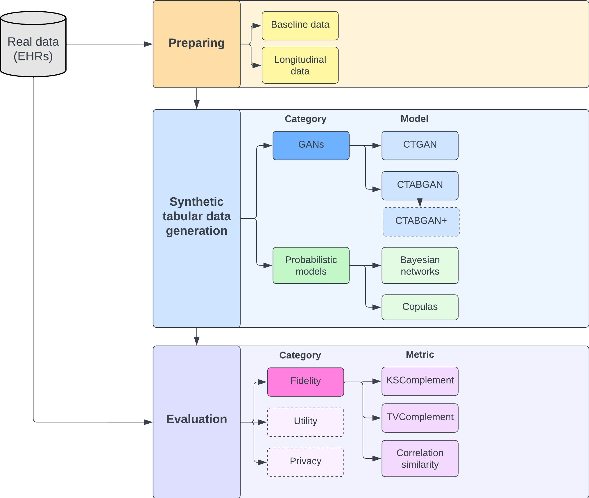

# Synthetic data generation

## Overview of the repository

This repository contains:
-  scripts that allow to generate synthetic tabular data with different models
- scripts to evaluate synthetic data

Global organization:


It is built as follows: 

```
├── config
│   ├── config.py
│   └── one config file per database 
├── requirements
│   └── one requirement file per model 
│   └── one requirement file per database 
├── scripts
│   ├── evaluate
│   │   └── one main per evaluation task (fidelity, utility, privacy...)
│   └── one folder per model 
│       └── one main per step (preparing, training...)
└── src
    ├── evaluating
    │   └── one script per evaluation task (fidelity, utility, privacy...)
    ├── loading.py
    ├── logger.py
    ├── modelling
    │   └── one folder per model 
    ├── parsers
    │   └── parsers are specific to tasks and/or database
    ├── preparing
    │   └── one folder per database
    │       └── one script per task
    ├── preprocessing
    │   └── one folder per model
    │       └── one scrip per step
    ├── utils
    └── visualizing
        └── one folder per model
```

The following models are for now included in the repository:

- Bayesian Networks (BNT) (https://pypi.org/project/bamt/)
- Copulas (https://sdv.dev/Copulas/)
- Conditional Tabular GAN (CTGAN) (https://arxiv.org/abs/1907.00503)
- Conditional Table GAN (CTABGAN) (https://arxiv.org/abs/2102.08369)

BNT and copulas were tested on the PPMI database. The two GANs were tested on the MIMIC-III database. 

## How to use the repository

If you wish to use one of the models from the repository to synthesize data or to evaluate synthesize data, the only file to change is `config/config.py`. You must change the following variables according to the model and database you want to work on:
- DATABASE: can be "ppmi" or "mimic-iii".
- MODEL: can be "bnt", "copulas", "ctgan" or "ctabgan".

Once done, you may run any of the main files located in the `scripts/` folder.

## Example: synthesize and evaluate data with CTGAN

#### Step 1: Switch the variables in `config/config.py`

In `config/config.py`, set `DATABASE = "mimic-iii"` and `MODEL = "ctgan"`.

#### Step 2: Prepare dataset

In your terminal, run the following command:

`python scripts/ctgan/main_preparing_mimic.py --remove-nan True`.

The --remove-nan argument allows to handle variables with missing values as CTGAN can't work with it.

The data will be saved in the synthetic data generation bucket under the following path: 

`output_data/ctgan/prepared_data/<DATE_OF_TODAY>_ctgan_mimic_iii_prepared_data.csv`

#### Step 3: Synthesize data

In your terminal, run: 

```
python scripts/ctgan/main_training_ctgan.py \
--mlflow-uri "<YOUR_URI>" \
--exp-name "<EXP_NAME FOR MLFLOW>" \
--dataset-path output_data/ctgan/prepared_data/ \
--dataset-filename <DATE_OF_TODAY>_ctgan_mimic_iii_prepared_data.csv \
--n-to-sample <NUMBER OF ROWS TO SYNTHESIZE> 
```

This will train the ctgan model on your prepared data and save the model in: 

`output_data/ctgan/models/<DATE_OF_TODAY>_ctgan_mimic_iii.pkl`.

If you put an int in --no-to-sample, it will create a synthetic dataset of n-to-sample rows that will be saved in: 

`output_data/ctgan/synthesized_data/<DATE_OF_TODAY>_ctgan_mimic_iii_synthesized_data.csv`

#### Step 4: Evaluate data fidelity

This step may be ran on its own with your own data if you already have synthetic data and the real data it was created from. 

In this example, you have to run in your terminal: 

```
python scripts/evaluating/main_evaluate_fidelity.py \
--real-dataset prepared_data/<DATE_OF_TODAY>_ctgan_mimic_iii_prepared_data.csv \
--synth-dataset <DATE_OF_TODAY>_ctgan_mimic_iii_synthesized_data.csv 
```
